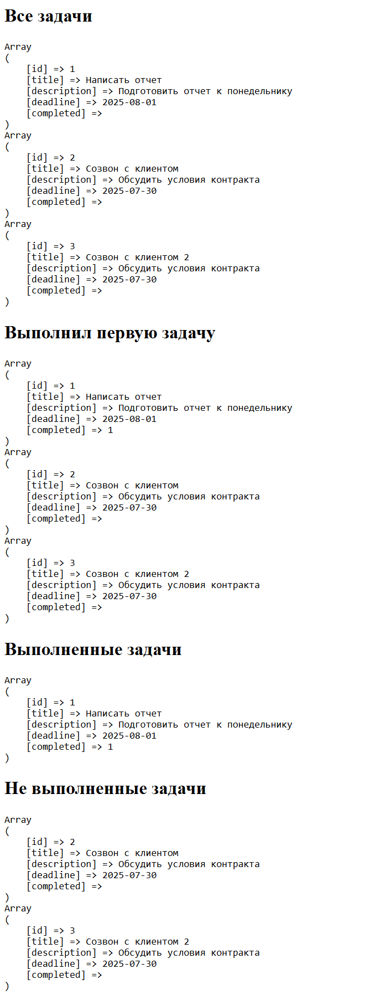
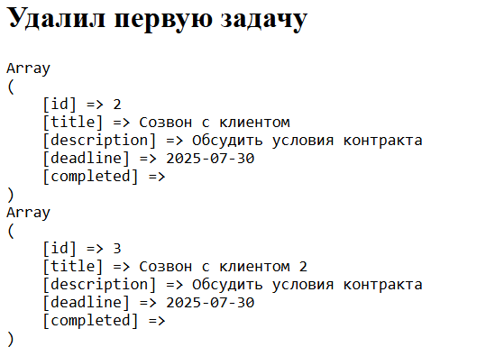

# ToDoManager-learning-
day 1

Сделай простую систему управления задачами (To-Do), в стиле OOP, без UI, только PHP-классы и взаимодействие между ними.

📋 Функциональность:
1 Создание задачи (название, описание, дедлайн)
2 Отметка задачи как выполненной
3 Удаление задачи
4 Список всех задач
5 Фильтрация по статусу (выполненные / невыполненные)

